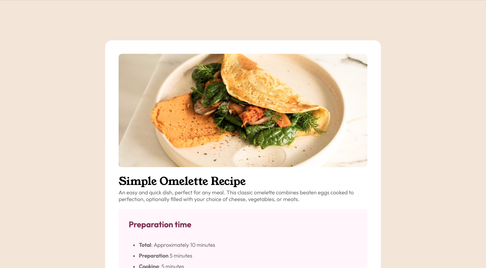

# Frontend Mentor

This is a solution to a Frontend Mentor challenges.

## Table of contents

- [Screenshot](#screenshot)
- [My process](#my-process)
- [Author](#author)

### Screenshot

## My process
Because of my lack of experience, finding the right padding and margin isn't the easiest thing for me. I spent a lot of time on it, same thing on the "responsive" part.

## Author

- Live Site URL: [Website](https://your-live-site-url.com)
